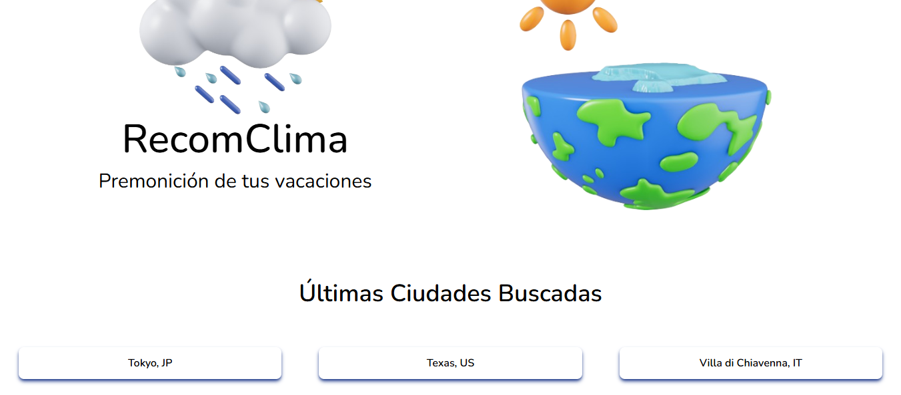
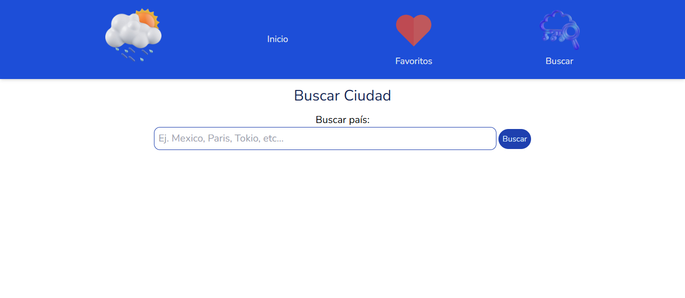
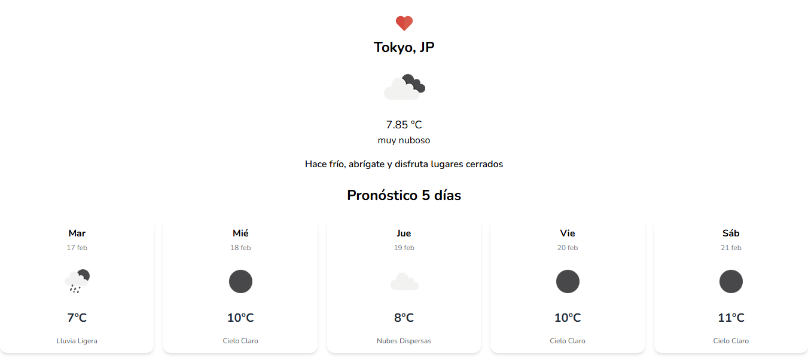
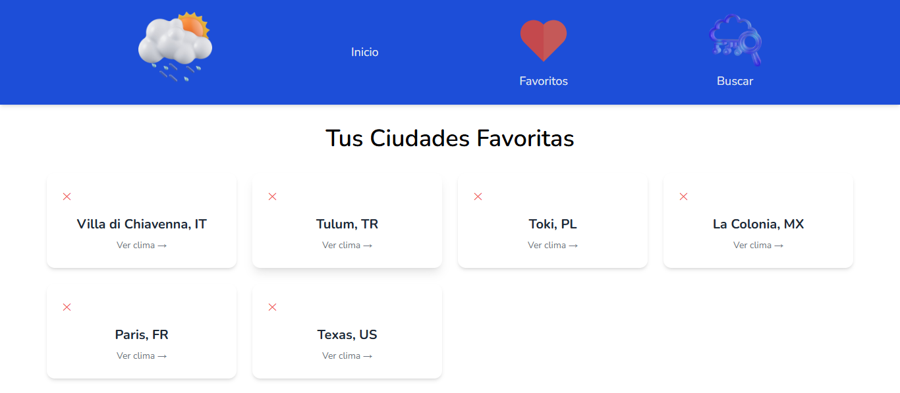

# RecomClima

## OpenWeatherMap API

Page dedicated to consume the OpenWeatherMap API to look at the weather and forecast of the city of your choice with the ability of marking your favorite cities and look at your most recent city searches. 

## Screenshots

### Home

### Home - Recent cities

### Search City

### Search City/Forecast - Example

### Favorites

## WEB PAGE DEPLOYED

- https://recomclima.netlify.app/

## Features

- Search cities and look at their weather.

- Recommendations of activities to do for each weather condition.

- Forecast of 5 days.

- Mark favorite cities.

- Look most recent cities searched.

- Clean and responsive UI.

## Technologies used

- **Javascript (vanilla)**
- **OpenWeatherMap API**
- **Html && CSS**
- **Tailwind CSS**

## Installation

- Download Node.JS (https://nodejs.org/es)
- Go to Tailwind v.3.4.17 and check Tailwind CLI installation (https://v3.tailwindcss.com/docs/installation)
- Run tailwind using npx tailwindcss -i ./src/input.css -o ./src/output.css --watch (step in the Tailwind CLI installation)

